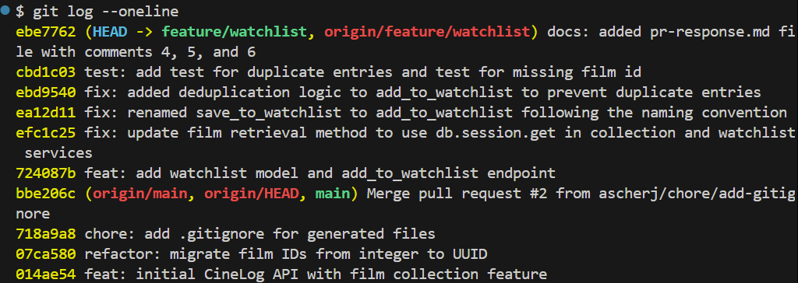

# PR Response Doc — CineLog Watchlist Feature

## AI Usage
One way I used AI tools was to diagnose an issue where I was unable to run the program due to duplicate SQLAlchemy instances. I went to AI, and it resolved this by creating a file to hold the db so that a duplicate isnt created when app.py is called and it doesn't have the db ready.
## Comment 1 — Rename
**What I did:**
Renamed save_to_watchlist in watchlist_service.py to add_to_watchlist. Changed implementations of save_to_watchlist in watchlist.py to add_to_watchlist.
**How I verified:**
I used the find-all-references in order to ensure that save_to_watchlist no longer appeared.
## Comment 2 — Deduplication
**What I did:**
Changed add_to_watchlist to check for deduplications, using add_to_collection from collection_service as a reference. Added an error class to watchlist_service for duplicate entries on watchlist.
**How I verified:**
Created a watchlist and added a film to it twice, noting that the second time produced a 409 error.
## Comment 3 — Missing test
**What I did:**
Created two tests modeled after test_add_to_collection_nonexistent_film_raises and test_add_to_collection_duplicate_raises to test whether duplicate entries raised an error and whether missing films raised an error
**How I verified:**
Ran the test and it passed.
## Comment 4 — Default visibility
**My position:**
Watchlists should be public by default.
**Reasoning:**
Because this app is a community film tracking app, the default behavior should be to interact with the community. Thus, the intention of the app is preserved, that being a way to communicate. A default behavior of sharing enhances this philosophy. Having watchlists being public by default means that people are able to observe what people believe is good before they watch it, thus leaning more into the community aspect.
**Tradeoff acknowledged:**
The downside of this position is that some users may not wish to have others view their watchlists, as it does not say anything besides that they have not watched this. The benefit of this is that users have more privacy by default, but can still choose to share if they wish. This could mean that watchlists may be more intentionally shared, thus possibly enhancing the quality of watchlists.

## Comment 5 — Sort order
**My position:**
I believe that the sort order should be by most recently added.
**Reasoning:**
I believe that similar to collections, watchlists should show entries based on the most recent entries. This allows users to more easily access their more recently added films which they may be searching for. An alphabetical ordered watchlist would remove this functionality, not providing anything to the user besides a more unbiased view of their watchlist, which they may not resonate with.
**Engagement with reviewer's point:**
I agree with the reviewer's point, that users will want to watch what they have recently added to their watchlist. I do not see how an alphabetical watchlist could add similar benefits.

## Comment 6 — Rebase
**What conflicted:**
The main source of conflict was .gitignore, where an additional file was added that I did not add. 
**How I resolved it:**
I added the file, as the other two files I had already added.
**How I verified no conflict remains:**
I looked through the rest of the files and saw no conflicts.

## PR Description
The watchlist feature is a list of films that the user that has the watchlist has not watched yet. It is public by default and its intended purpose is to be a way for the user to indicate things that they are interested in but have not watched yet. The visibility default for the watchlist should be public, and the sort order for watchlists is by most recently viewed. To test this feature, first have a user add to their watchlist by calling add_to_watchlist. To test the film id existence, use a nonsensical id. To test the deduplication code, repeat add_to_watchlist with the same information.